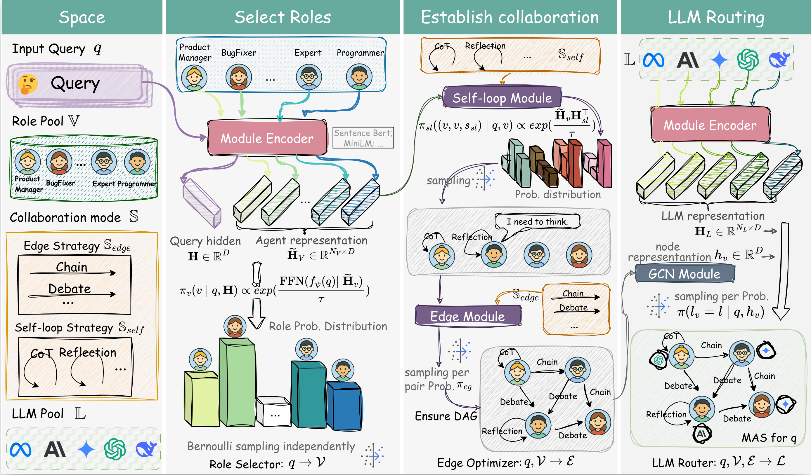

# From Individuals to Collaboration: Learning to Construct Multi-Agent Systems Dynamically

## Method Overview




## Quick Start

### Datasets
Please download the GSM8K, HumanEval, MATH, MBPP, MMLU datasets and place it in the Datasets folder. The file structure should be organized as follows:

```text
Datasets
└── gsm8k
    └── gsm8k.jsonl
└── humaneval
    └── humaneval-py.jsonl
└── MATH
    └── test
    └── train
└── mbpp
    └── mbpp.jsonl
└── MMLU
    └── data
```

### Add API keys
Add `llm_pool.yaml` in the `llms` folder. The file should look like this:

```yaml
-
  "model": "gpt-4o-mini"
  "description": "..."
  "support": "openai"
  "llm_param":
    "base_url": ...
    "api_key": ...
    "prompt_price": ...
    "completion_price": ...
```

### Run the code
The code below verifies the experimental results of the humaneval dataset.
```aiignore
python run_humaneval.py
```

## Acknowledgement
Special thanks to the following repositories for their invaluable code and datasets:

[GPTSwarm](https://github.com/metauto-ai/GPTSwarm)
[MasRouter](https://github.com/yanweiyue/masrouter/tree/main)
